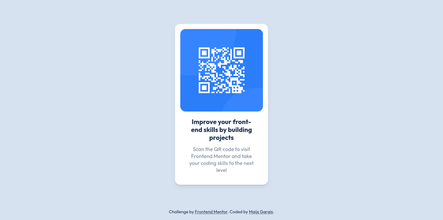

# Frontend Mentor - QR code component solution

This is a solution to the [QR code component challenge on Frontend Mentor](https://www.frontendmentor.io/challenges/qr-code-component-iux_sIO_H). Frontend Mentor challenges help you improve your coding skills by building realistic projects.

## Table of contents

- [Overview](#overview)
  - [Screenshot](#screenshot)
  - [Links](#links)
- [My process](#my-process)
  - [Built with](#built-with)
  - [Continued development](#continued-development)
- [Author](#author)

## Overview

### Screenshot

### Links

- Solution URL: [Frontendmentor.io](https://www.frontendmentor.io/solutions/qr-code-component-using-react-and-tailwind-XV-jWd6GPq)
- Live Site URL: [View on Vercel](https://qr-code-component-seven-mu.vercel.app/)

## My process

### Built with

- Flexbox
- [React](https://reactjs.org/)
- [TailwindCSS](https://tailwindcss.com/)
- [Vite](https://vitejs.dev/)

### Continued development

I discovered that, on mobile browsers, 100vh corresponds to the window height if the navigation bar is hidden - meaning users have to scroll down until it is hidden to see the very bottom of the page at the moment. Trying to find a good solution for this.

## Author

- Website - [Maijs Garais](https://mai-soup.github.io)
- Frontend Mentor - [@mai-soup](https://www.frontendmentor.io/profile/mai-soup)
